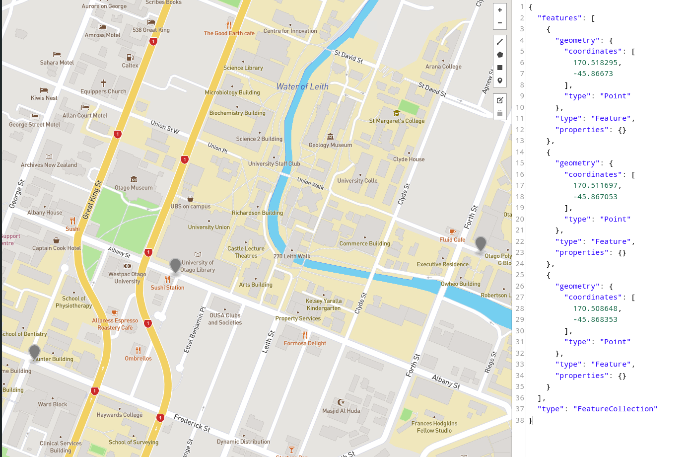

# GeoJson Java
A java program that cleans geographic coordinate input and writes to a GeoJson file.

Requires:

```JDK```

```Make```

```Json-simple.jar```(provided)

```Gson.jar```(provided)

## Usage
Compile with `$ make` and run with make `$ make geo`

Input files can be piped from `stdin` or enter coordinates manually.

```$ make Geo < foo.txt```

When using a file for input ensure no whitespaces are present after each input, and each new coordinate begins on a new line.

## Formatting 
Accepts a geographic coordinate in standard form or degrees minutes seconds.

Must be a delimiter of either `space` or `,` between latitude and longitude.
```<latitude><, ><longitude>```
Cardinal directions can be given with `<n,N,North|s,S,South|e,E,East|w,W,West>`

When entering input in degrees minutes seconds form cardinal Direction must be given with Capital letters to differentiate from units.


```DD<d*° >MM<m' >SS.SS<s' >[NSEW|North|South|East|West]<, >DD<d*° >MM<m' >SS.SS<s' >[NSEW|North|South|East|West]```

## Dependencies 
1. Json-simple - https://code.google.com/archive/p/json-simple/
2. Gson - https://github.com/google/gson - [API_Docs](https://www.javadoc.io/doc/com.google.code.gson/gson)

### Installation of dependencies
Download [Json-simple](https://code.google.com/archive/p/json-simple/downloads) and [Gson](https://search.maven.org/remotecontent?filepath=com/google/code/gson/gson/2.8.6/gson-2.8.6.jar). Place both `jar` files in the root of the program directory (`PATH_TO_PROGRAM/etude_7/`).


### Testing and Method
`validTest.txt` - Valid inputs

`invalidTest.txt` - Invalid inputs

My method for this etude was to match the input to one of 3 formats and simplify down to standard form.

    1. Degrees Minutes Seconds
    2. Degrees Minutes 
    3. Standard form plus cardinal directions 


I used regex to match the input in the most general form I could and then cleaned the input for processing.
I cleaned the all symbols to separate each part of the input, by a `,`. The numbers are set to negative or positive based on the cardinal direction. I converted the degrees minutes seconds and degrees minutes to standard form. once all the input was in standard form i converted them to doubles and validated the input based on the specification. 

The geoJson file I validated using the website https://www.geoJson.io checking coordinates I knew the postion off, located in `reportCords.txt`.

